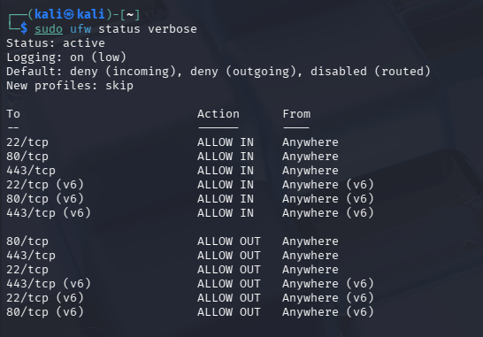
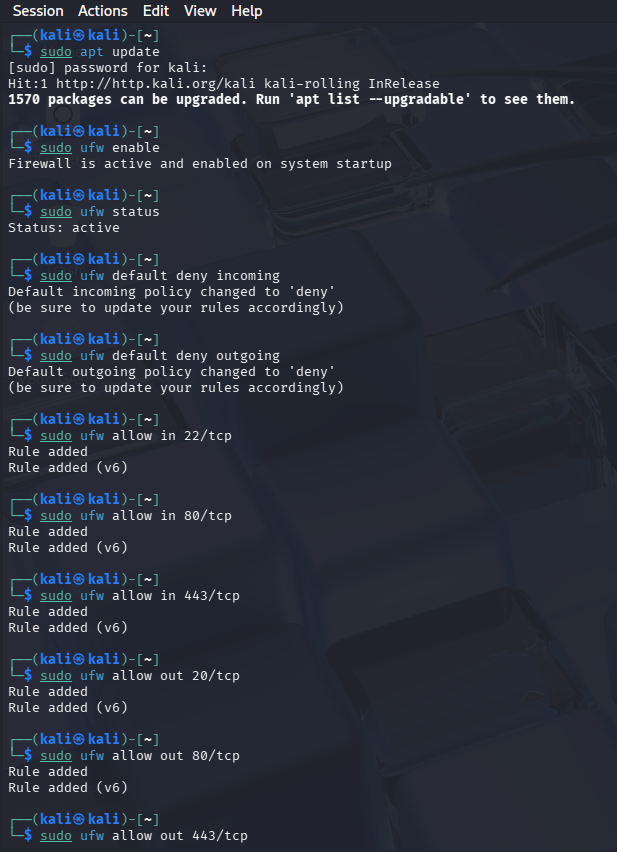
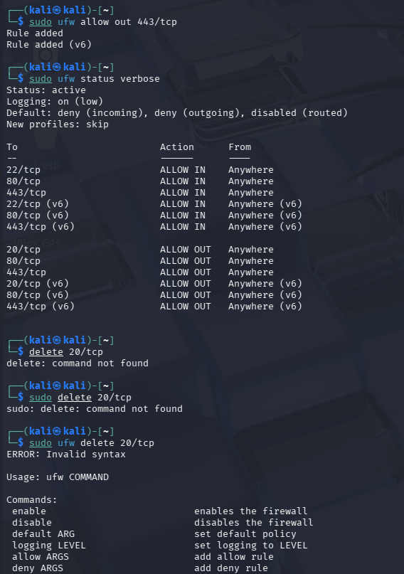
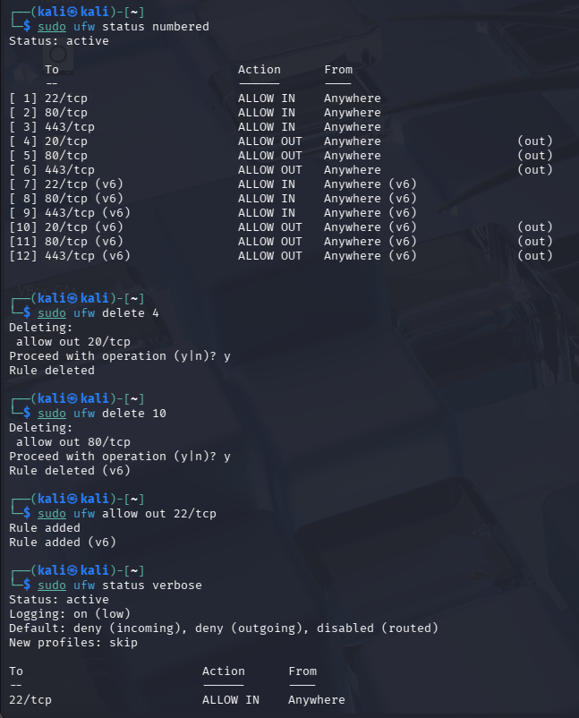
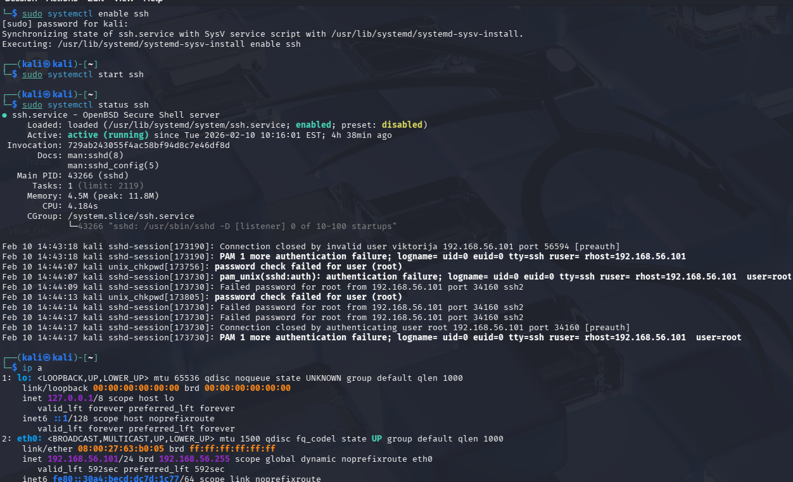
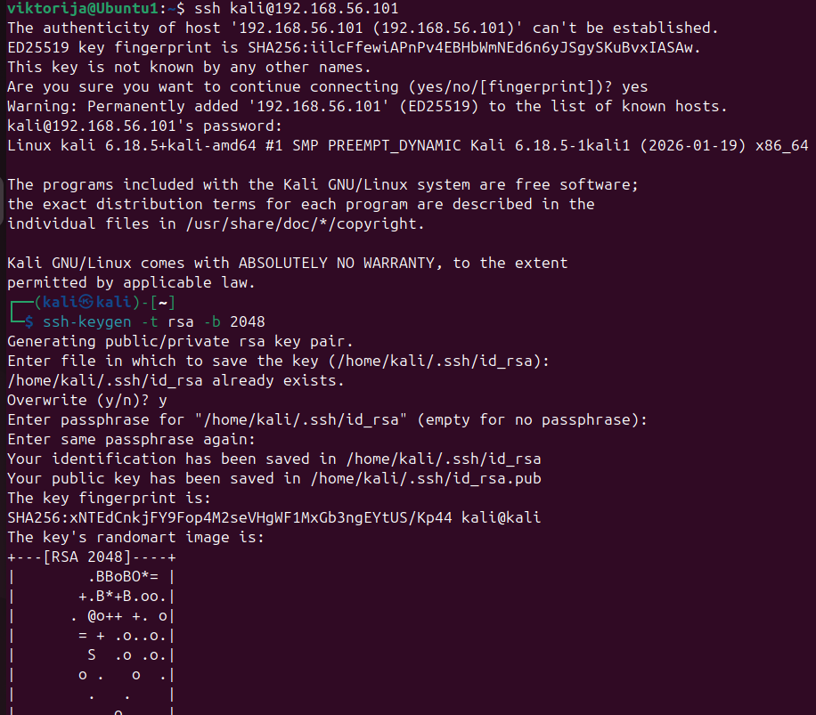
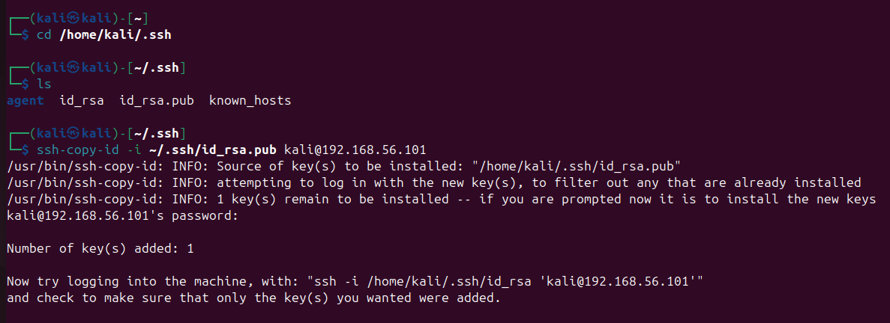
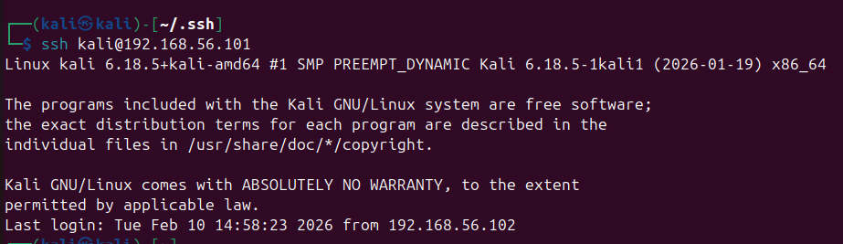
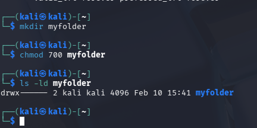

# linux-security-lab
Practical Linux security tasks completed as part of a cybersecurity course exam. Covers UFW firewall configuration, SSH key-based authentication between two virtual machines and Linux file permissions.

**Tools used:** UFW, SSH, ssh-keygen, ssh-copy-id, chmod  
**Environment:** Ubuntu and Kali Linux on VirtualBox

---

## Task 1 - UFW Firewall Configuration

The goal was to configure UFW (Uncomplicated Firewall) on a Linux system to allow only the necessary traffic and block everything else.

**Rules configured:**
- Default policy: deny all incoming, allow all outgoing
- Allow port 22 (SSH)
- Allow port 80 (HTTP)
- Allow port 443 (HTTPS)

This kind of minimal-access configuration reduces the attack surface - if a port isn't needed, it shouldn't be open.



The full path of configuration:





---

## Task 2 - SSH Key Authentication Between Two Linux Servers

The goal was to set up passwordless SSH login from an Ubuntu machine to a Kali Linux machine using key-based authentication.

**Steps taken:**

1. Enabled and started the SSH service on the Kali machine, confirmed it was listening on port 22
   
   
   
2. Generated an SSH key pair on Ubuntu using ssh-keygen - this created a public and private key in `~/.ssh/`

   
   
3. Copied the public key to the Kali machine using:
   ```
   ssh-copy-id -i ~/.ssh/id_rsa.pub kali@192.168.56.101
   ```
   
   
4. Tested the connection - login succeeded without a password, confirming key authentication was working

   

**Why SSH keys are better than passwords:**

Passwords can be guessed or intercepted. SSH keys use cryptography - the private key never leaves your machine and only the matching public key is stored on the server. This also protects against brute force attacks since there's no password to guess.

**Troubleshooting I had to do:**

This didn't work on the first attempt. The issues I ran into and fixed:

- Had to edit `/etc/ssh/sshd_config` to correct settings for `Port 22`, `ListenAddress`, `PasswordAuthentication` and `PermitRootLogin`
- Fixed file permissions on the `.ssh` directory - it needed `drwx` (700) for the owner only, not `drwxr-x`
- Monitored SSH logs in real time to identify where connections were being rejected

I'm including this because troubleshooting is part of the job - things don't always work first time and being able to diagnose and fix the issue is the actual skill.

## Task 3 - File Permissions

Created a directory called `myfolder` and configured permissions so only the owner can access it.

Command used:
```
chmod 700 myfolder
```

The `700` permission means: owner can read, write and execute - everyone else has no access at all. This is important for protecting sensitive files from other users on the same system.



---

## What I learned

- UFW makes firewall management straightforward but the principle behind it default deny, explicit allow, is the right way to think about network security;
- SSH key authentication is one of those things that seems complicated until you do it, then it becomes the obvious way to handle server access;
- Troubleshooting the SSH setup taught me more than if it had worked first time - reading logs, checking config files, and fixing permissions one step at a time.

---

**Context:** Cybersecurity course exam task  
**Tools:** UFW, SSH, VirtualBox, Ubuntu, Kali Linux

---
